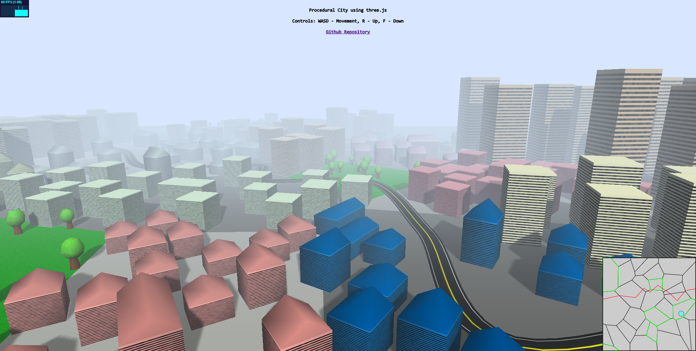
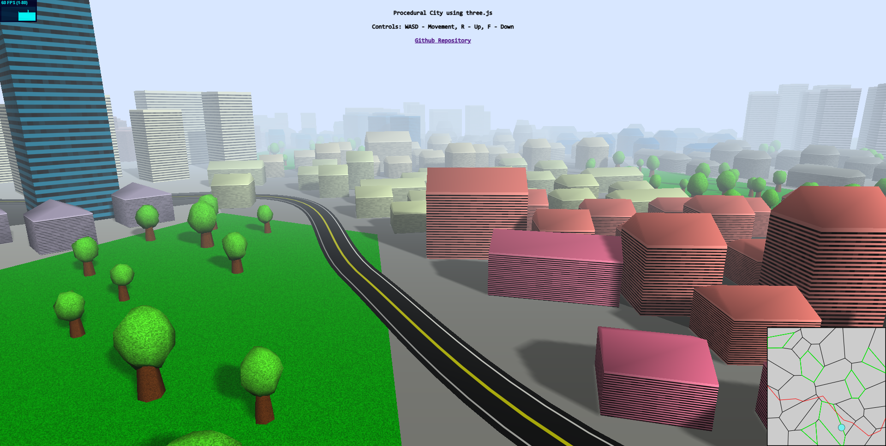

# ThreeJsProceduralCity
a procedurally generated 3D by using JavaScript and three.js. Created for a "Computer Graphics" subject assignment at University.

Check it out live at: https://zukas3.github.io/ThreeJsProceduralCity/

## Usage

Simply clone the repository and open index.html in your browser :).

## Media

